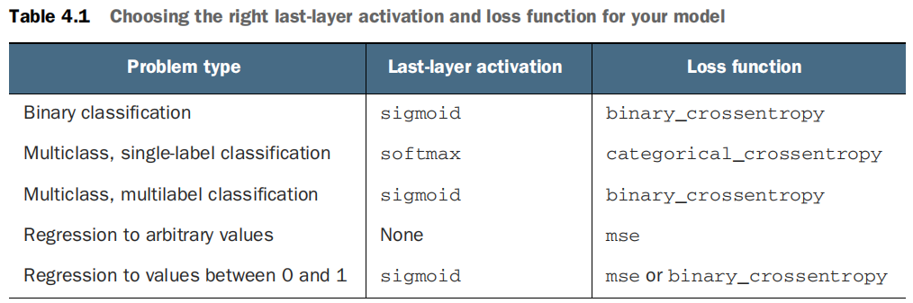

## Deep Learning with Python 

* Source: **Book** 
* Recommened to: **Lower intermediate** learners

The book is written very systematically which is easy to follow. Some concepts are explained quickly like backpropagaation (I think it needs more attention). Best thing about this book is all concepts are explained with examples that reader can easily understand. 

* Chapter 1 and 2 are general information about Deep Learning (DL). The core of the book starts from Chapter 3, there are 3 real problems are given as examples:IMDB (binary classification), News Types (multiclass) and Boston Housing Price Prediction (scalar regression). These examples give clear understanding about the DL. 

* In Chapter 4, all machine learning forms are discussed briefly: supervised learning (...), unsupervised learning (clustering, dimensionality reduction), self supervised learning (autoencoders), reinforcement learning. All of them are just explained briefly for creating general vision and knowledge about overall ML. Following that, how to evaluate models, how to split dataset into train, validation and testing with correct way, validation types (cross validation, hold-out validation, ...), data preprocessing before giving it to model (vectorization, value normalization, handling missing values, ...) and finally how to overcome overfitting and underfitting are explained briefly (but it is enough for good start). 

##### **Adding weight regularization** 
* L1 regularization—The cost added is proportional to the absolute value of the weight coefficients (the L1 norm of the weights). 
* L2 regularization—The cost added is proportional to the square of the value of the weight coefficients (the L2 norm of the weights). L2 regularization is also called weight decay in the context of neural networks. Don’t let the different name confuse you: weight decay is mathematically the same as L2 regularization.

**l2(0.001) means every coefficient in the weight matrix of the layer will add 0.001 * weight_coefficient_value to the total loss of the network. Note that because this penalty is only added at training time, the loss for this network will be much higher at training than at test time.**

**Note**: When model overfits, the model just memorizes the train samples. The reason is that model is very strong and it has many layers and nods which quite enough capacity for memorizing.  

##### Adding dropout 
Dropout is one of the most effective and most commonly used regularization techniques for neural networks, developed by Geoff Hinton and his students at the University of Toronto. Dropout, applied to a layer, consists of randomly dropping out (setting to zero) a number of output features of the layer during training. Let’s say a given layer would normally return a vector [0.2, 0.5, 1.3, 0.8, 1.1] for a given input sample during training. After applying dropout, this vector will have a few zero entries distributed at random: for example, [0, 0.5, 1.3, 0, 1.1]. The dropout rate is the fraction of the features that are zeroed out; it’s usually set between 0.2 and 0.5. At test time, no units are dropped out; instead, the layer’s output values are scaled down by a factor equal to the dropout rate, to balance for the fact that more units are active than at training time.

####  To recap, these are the most common ways to prevent overfitting in neural networks: 
* Get more training data. 
* Reduce the capacity of the network 
* Add weight regularization. 
* Add dropout. 

